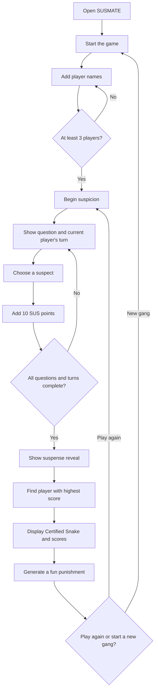

# SUSMATE 🐍

SUSMATE is a fun interactive  game that helps a group discover who is the most suspicious.


## Basic Details
### Team Name: [She squad]


### Team Members
- Team Lead: [Fathima Fidha] - [kmea engineering college]
- Member 2: [Nehrin A] - [kmea engineering college]

### Project Description
[ SUSMATE is a fun interactive web application where friends answer funny questions and vote for the most suspicious person in their group. Based on the votes, the app calculates a SUS score, reveals the "Certified Snake," and gives them a fun harmless punishment.]

### The Problem (that doesn't exist)
[Friend groups have a serious problem: everyone claims to be innocent, but nobody knows who the real snake is! SUSMATE solves this completely unnecessary crisis by analyzing suspicious votes and exposing the most SUS person in the group.]

### The Solution (that nobody asked for)
[SUSMATE bravely tackles this completely unnecessary crisis! Friends answer ridiculous questions, vote for the most suspicious person, and our system calculates their SUS score to finally expose the group's Certified Snake followed by a fun punishment they definitely didn't ask for!]

## Technical Details
### Technologies/Components Used
For Software:
- Languages used: Python, HTML, CSS
- Frameworks used: Flask
- Libraries used: random
- Tools used: VS Code, GitHub

### Implementation
For Software:
SUSMATE is implemented as a Python-based web application using the Flask framework. The frontend is developed using HTML and CSS, while Python handles the game logic, question selection, SUS-score calculation, and final snake-friend detection. The random library is used to introduce random questions and outcomes.
# Installation
[```bash
pip install flask]

# Run
[```bash
python app.py]

### Project Documentation
SUSMATE is a fun interactive web application where friends answer funny questions and vote for the most suspicious person. The application calculates SUS scores and reveals the group's certified snake

# Screenshots (Add at least 3)

*The SUSMATE home page welcomes players to the game and allows them to start their suspicious adventure!*


*players answer funny questions and vote for the friend they find the most suspicious*


*the application calculates the sus scores and dramatically reveals the most suspicious person as the certified snake!*

# Diagrams

*The workflow shows how players are added, how each vote increases a SUS score, and how the highest-scoring player is revealed as the Certified Snake.*


### Project Demo
# Video
[https://drive.google.com/file/d/1XURruuOkSea3le5aMWyJkqAHda7-tGGd/view?usp=sharing]
*The workflow diagram shows how SUSMATE works from start to finish. Players first enter their names and start the game. They then answer funny and suspicious questions by voting for their friends. The system calculates SUS scores based on the votes, identifies the player with the highest score, and dramatically reveals them as the Certified Snake. Finally, a random fun punishment is generated and players can start a new game.*

## Team Contributions
- [fathima fidha mp]: [Game Logic & Python Development*

* Developed the core game logic using Python.
* Created the questions, answer options, and scoring system.
* Implemented the snake-friend detection and final result generation.
* Tested the functionality and fixed errors.]
- [Nehrin.A]: [UI/Design & User Experience*

* Designed the app interface and overall appearance.
* Created the start screen, friend-name input, question screen, and result screen.
* Worked on the funny messages, punishments, and visual presentation.
* Assisted with testing and project documentation.]

---
Made with ❤️ at TinkerHub Useless Projects 


